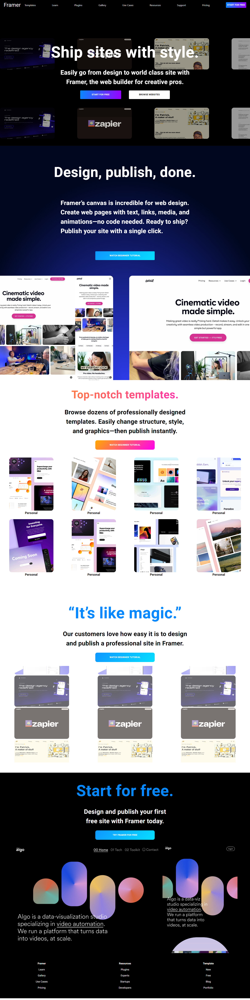

# Framer

[](https://app.netlify.com/sites/framer14/deploys)

Framer is a landing page App built with Next.js that simulates a Mock for the [Framer Platform](https://framer.com).


 

## Demo

https://user-images.githubusercontent.com/69651552/214382467-d241abb1-f5bb-493a-b48e-f1cc7a7d73c8.mp4

## Instructions, Building & Get Started 
    - 1- Fork, clone or download this repository to your local machine.
    - 2- Be sure that you install the [Node.js](https://nodejs.org/en/) environment in your machine.
    - 3- Open your terminal and be sure that you are inside the correct destination of the App, while you must be in the same path of the package.json file.
    - 4- inside your terminal run these commands:-
    
        * to install dependencies.
        ```
        yarn
        ```
        * to start the server.
        ```
        yarn dev
        ```
    - 5- Once the app server is running visit (localhost:3000) in the browser to view the app and now you can treat with it as shown above in the Demo.

    - 6- You can also see a live preview of the app from this Link (https://cinema-universe.netlify.app/)

## Built With

* HTML
* CSS
* JS

## Libraries & Packages

* [Styled Components](https://styled-components.com/)
* [React Slick](https://www.npmjs.com/package/react-slick)

## Frameworks 

* [React.js](https://reactjs.org/)
* [Next.js](https://nextjs.org)  
* [React Bootstrap](https://react-bootstrap.github.io/)
* [Material UI](https://mui.com)

## Author

* [Mohamed Elhawary](https://www.linkedin.com/in/mohamed-elhawary14/) 

## Contact me through my social accounts

* Email: mohamed.k.elhawary@gmail.com  

* [Linkedin](https://www.linkedin.com/in/mohamed-elhawary14/)

* [Codepen](https://codepen.io/Mohamed-ElHawary)

* [Behance](https://www.behance.net/mohamed-elhawary14)

## License

Licensed under the [MIT License](LICENSE)
